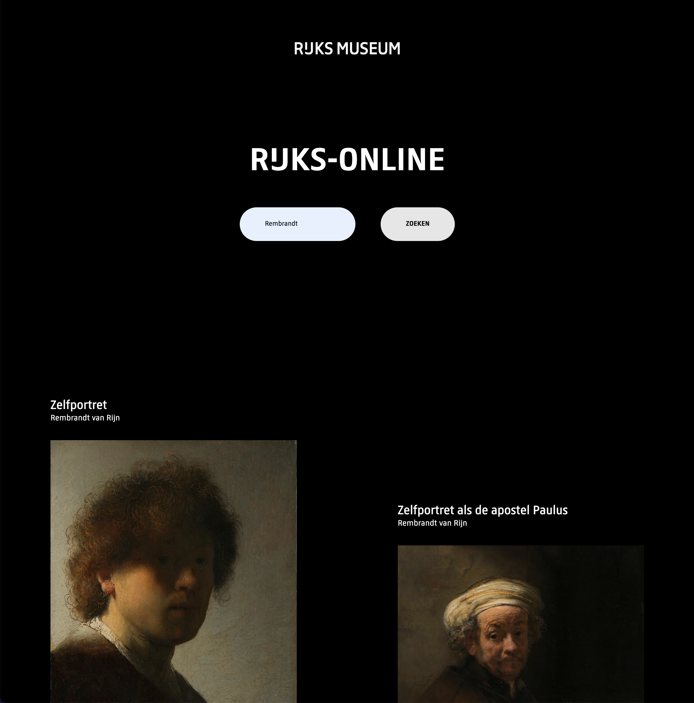
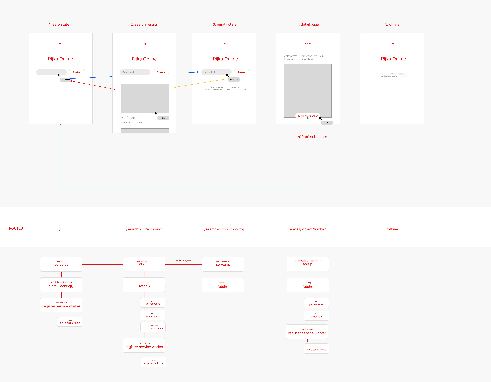

# Progressive Web Apps


## Live DEMO
https://rijks-online.herokuapp.com



## Description


## Activity Diagram


## Reflectie
Ik ben erachter gekomen wat een bugs sommige websites nog hebben als je wat lagen weg gaat halen. Ook is het echt nog een klus om je website progressive ehancement proof te maken. Toch heb ik in deze 3 weken enorm veel geleerd. In het begin klonk het wat saai, maar ik vond het super interessant en leuk om mee bezig te zijn. Het is jammer dat we maar 3 weken hadden, ik had graag nog meer tijd erin gestoken om echt nog iets beters te maken. Toch heb ik mijn best gedaan voor die 3 weken en ben ik trots op mijn eindproduct. Ik ga zeker meer nadenken ook over progressive ehancement als ik aan andere projecten ga werken (ook buiten school).

## Table of Contents

- [Install](#install)
- [Features](#features)
- [Used Tools](#used-tools)
- [Meta](#meta)
- [License](#license)

## Install

Clone the GitHub Repo locally
```
git clone https://github.com/DaanKetelaars/PWA
```

Connect your API Key.

- Go to the Rijks Studio.
- Create an account.
- Go to advanced settings and ask for your own personal API key.
- Create an .env file and add your own API key. Name it API_KEY in the .env file.
```
`https://www.rijksmuseum.nl/api/nl/collection/?key=${api}`
```

Install all packages
```
npm install
```

Host this project on localhost. 
```
PORT = 8080
```

## Used Tools

- [git](https://git-scm.com/)
- [NodeJS](https://node.jshttps://nodejs.org)
- [ExpressJS](https://expressjs.com/)

## Meta
For any questions, don't hesitate to reach out!
Daan Ketelaars - daanketelaars@gmail.com - https://github.com/DaanKetelaars/PWA

## License

Usage is provided under the [MIT License](https://github.com/git/git-scm.com/blob/master/MIT-LICENSE.txt) MIT. See [LICENSE](https://github.com/DaanKetelaars/PWA/blob/master/LICENSE) for the full details.


